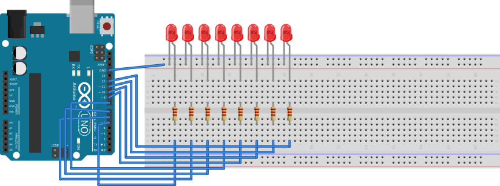

# Cellular automata: Wolfram's rule 110 visualization

## Requirements
* x9 wire
* x8 resistors
* x8 LED

## Description
One-dimensional cellular automata -- dynamic system where each element has two
states (0 or 1) and two neighbors (left and right). Every iteration state of element changed depends
states of neighboring. There is **Wolfram rule 110** in follows:
```
000 -> 0
001 -> 1
010 -> 1
011 -> 1
100 -> 0
101 -> 1
110 -> 1
111 -> 0
```
Where three bits -- states of left neighbor, current element and right neighbor
correspondingly. Boundary conditions might be zeros or cycled.



