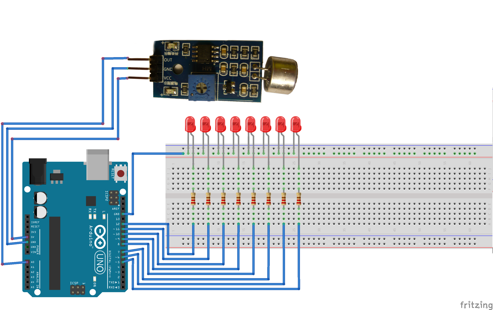

# The simplest Arduino equalizer

## Requirements
* x12 wire
* x8 resistors
* x8 LED
* x1 microphone module

## Description
This sample is used to test microphone module usage. Video demonstration:

