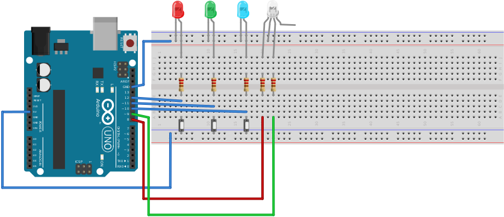

# Sequencer: Arduino mini game

## Requirements
* x7 wire
* x5 150&Omega; resistors
* x3 LED
* x1 RGB-LED (or x1 red + x1 green)

## Description
Player should repeat sequence of lights by pushing corresponding buttons.
After correct repeat, RGB LED flashing green and sequence increments. If player
make mistake, RGB LED is red and player should repeat the sequence from
beginning.  
Pins 10-12 used as output for showing target sequence and as input for receiving
player's turns.

