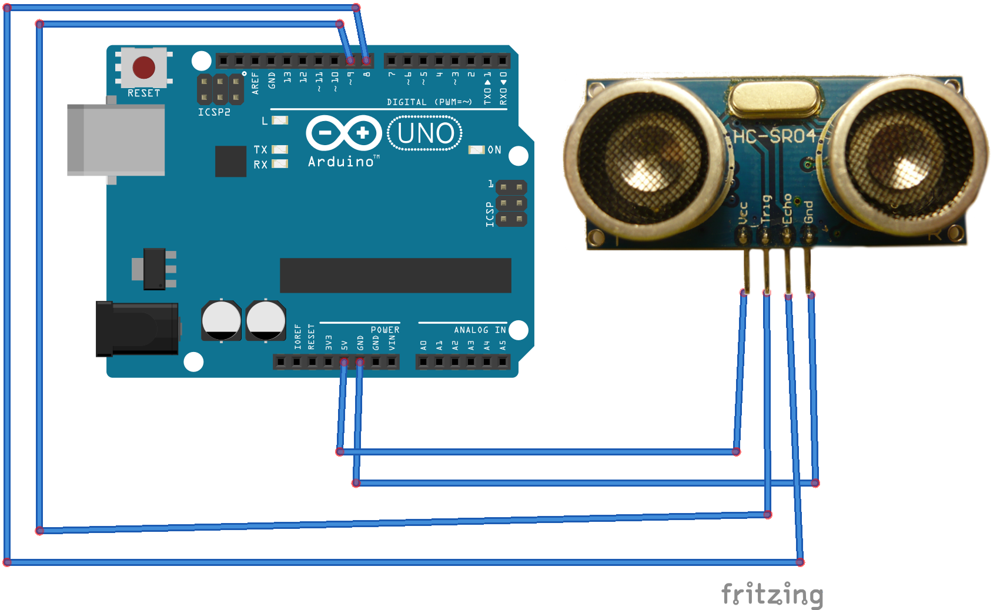

# Arcade with Arduino and ultrasonic sensor

## Requirements
* x4 wires
* x1 ultrasonic sensor

## Description
Install necessary dependencies once:
```bash
sudo pip install -r requirements.txt
```
After the sketch is uploaded type to run a game:
```bash
python game.py
```
Video demonstration:  
[](https://youtu.be/s9Pr6fOl-lc)


